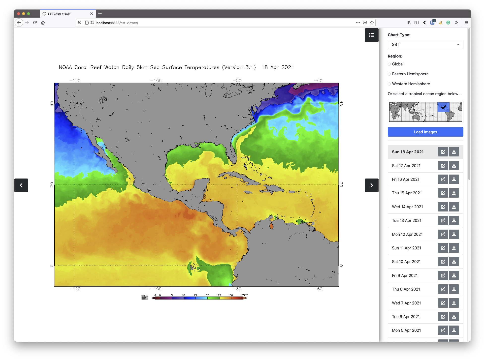
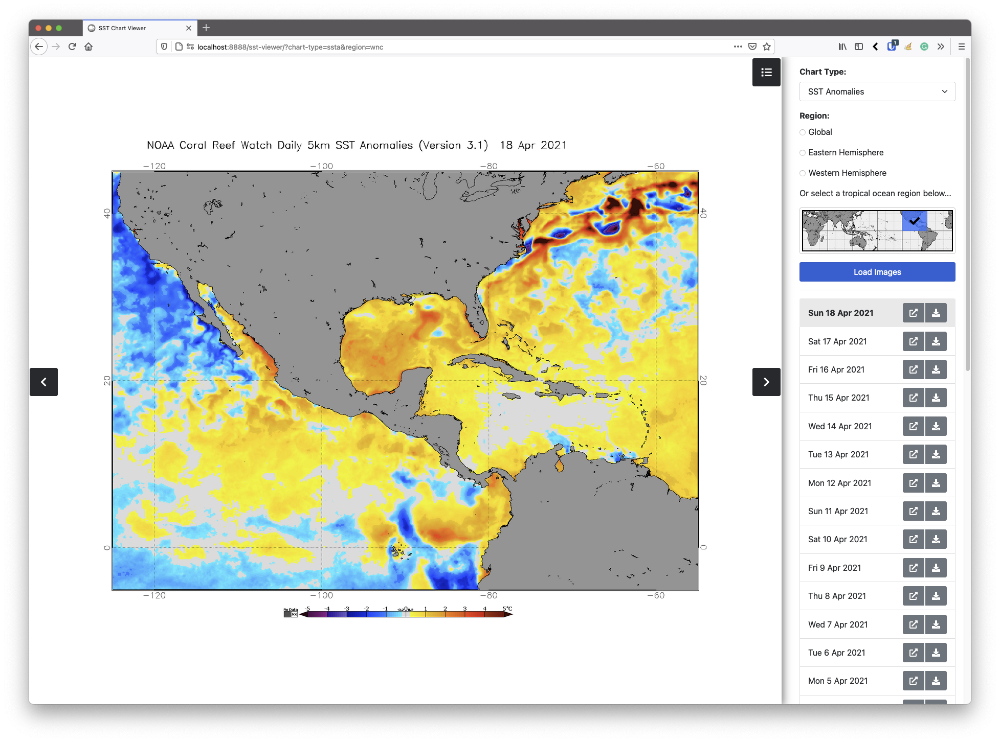

Sea Surface Temperature Chart Viewer
=====================

## Introduction

This web app downloads [SST (sea surface temperature)](https://en.wikipedia.org/wiki/Sea_surface_temperature) charts from NOAA spanning the previous 30 day range (with a one-day lag). 

These GIF images are cached locally on the web server. The SST charts can be navigated using the previous/next controls or your keyboard left/right arrow keys. The selected chart gets shown in the side panel, with buttons to view it in a new browser window or to download it. 

You can view observed SSTs with this chart viewer:

Or view SST anomalies (temperature departures from normal):

The sea surface temperature chart viewer is intended to be hosted on a website, from where website users can easily access the chart data. It can also be useful to include in YouTube recordings and suchlike. It was originally made for [hurricanetrack.com](hurricanetrack.com). SSTs are a major influence in the forecasting of tropical cyclones.

From the top of the side panel, you can choose the chart type displayed (sea surface temperature or sea surface temperature anomalies). The region you want to view can be selected with the radio buttons or you can select a tropical ocean region from the map. After you change the Chart Type or Region, click on the Load Images button to download the required GIF images from NOAA and load them into the chart viewer.

## Dependencies

A web server running PHP 7.6 or later. I have tested it on a server running PHP 8, and it worked fine. The user interface is built with [Bootstrap 5](https://getbootstrap.com/) and [Font Awesome Icons](https://fontawesome.com/). For privacy and reliability, I prefer hosting these myself (instead of using a CDN) so both are included in the download, but you may prefer to change this.

## Downloading and deploying chart viewer

On the Github website, download the ZIP archive of the sea surface temperature chart viewer. Uncompress the package. Copy the **sst-viewer** directory to your web server. It can be renamed whatever you like. Navigate to the sst-viewer directory in your web browser, to allow it to begin building its chart cache, for the first time. Chart images are cached locally, to avoid 'hitting' the NOAA servers with a large number of HTTP requests. 

## Important!

The first time you launch the sea surface temperature chart viewer in your web browser (or if you revisit it after a period of several days or weeks) it is completely normal for it to appear "frozen" and not progressing. Instead what it's doing is downloading and caching the missing images. Because some of this chart data can be 20 MB or more, this process can sometimes take a few minutes to complete. It depends how fast your web server or internet connection is. Please give it time to complete!

## License

MIT licensed, so feel free to use, modify and redistribute as you see fit.

## Need further help?
The sea surface temperature chart viewer is activity developed and supported by myself. I am available for hire if you need it customised to your specific requirements. I can also share my expertise and help with developing other weather-related web apps. Feel free to [get in touch](https://willwoodgate.com/) via my website.